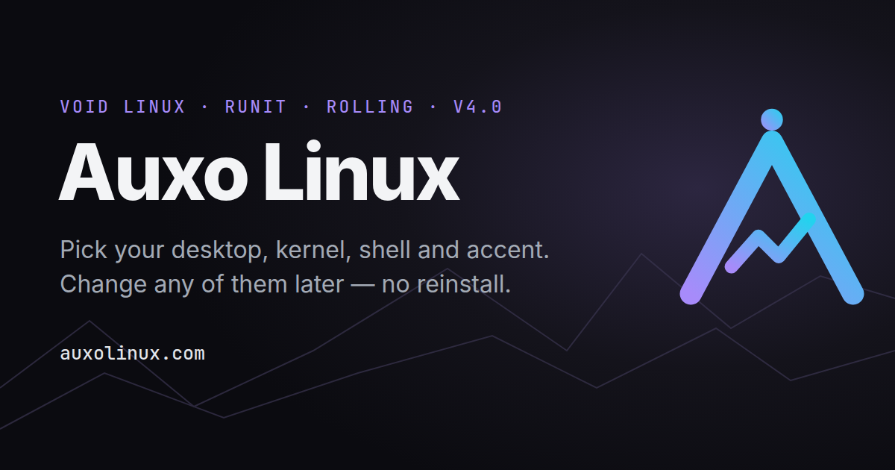

<p align="center">
  
</p>

<h1 align="center">Auxo Linux</h1>

<p align="center">
  <b>Arch Linux, set up the way you want it.</b><br>
  An Arch-based rolling distro with a graphical installer. Pick your desktop, kernel, shell and accent colour,
  then change any of them later with one command. No reinstall.
</p>

<p align="center">
  <a href="https://auxolinux.com">Website</a> ·
  <a href="https://auxolinux.com/download/">Download</a> ·
  <a href="https://auxolinux.com/docs/">Docs</a> ·
  <a href="https://discord.gg/XbQ66dH5a7">Discord</a> ·
  <a href="CHANGELOG.md">Changelog</a>
</p>

<p align="center">
  
</p>

---

## What it is

Auxo is Arch underneath: the official repositories, pacman, the AUR and the Arch Wiki all work as normal.
On top it adds:

- a **Calamares installer** with pages for Desktop, Accent, Kernel, Shell and extra software
- **`auxo-tweak`**, which changes any of those choices after install. The installer calls the same
  commands, so changing something later gives the same result as a fresh install
- **bootable btrfs snapshots** on every pacman transaction, with `auxo-rollback` to make one your system again

```bash
auxo-tweak desktop hyprland     # switch your whole desktop
auxo-tweak accent rose          # recolour GRUB, boot splash, login, prompt, terminals and bars
auxo-tweak kernel linux-zen     # swap kernels
auxo-tweak gaming on            # Steam, GameMode, MangoHud, Gamescope + tweaks
auxo-update                     # Arch news check → snapshot → repo + AUR + Flatpak
auxo-rollback --list            # list snapshots
```

## Features

| | |
|---|---|
| **GUI installer** | Calamares with Auxo branding and its own Desktop, Accent, Kernel, Shell and Software pages, each with a preview image. |
| **8 desktop choices** | KDE Plasma 6 (the live desktop, installs offline), Hyprland, Sway and i3 with **Auxo rices** (bar, launcher, notifications, lock screen and screenshots wired up), plus GNOME, Xfce, Cinnamon, or no desktop. |
| **One accent, everywhere** | 7 accents (violet, cyan, emerald, amber, rose, blue, mono), applied to the GRUB theme, the boot splash, the login screen, the MOTD, zsh/fish/bash prompts, kitty/foot/alacritty, waybar/polybar, mako/dunst and the KDE/GNOME accent. |
| **Text login screen** | greetd + tuigreet in your accent colour. It works the same on every desktop, GPU and VM. F3 switches session. |
| **Boot splash** | An animated Plymouth theme: the Auxo mark in your accent with a climber running up the trail. `auxo-tweak splash on\|off\|status` |
| **Time-travel snapshots** | Flat btrfs layout (`@ @home @log @cache @snapshots`). snapper + snap-pac snapshot every pacman run, grub-btrfs makes them bootable, and `auxo-rollback` turns one back into your live system. `/home` is never touched. |
| **Hardware autodetect** | NVIDIA Turing and newer get `nvidia-open` (`-dkms` on zen/lts) with modesetting. AMD and Intel get Vulkan and VA-API. `auxo-tweak drivers --prune` removes drivers and VM guest tools you don't need. |
| **Gaming** | `auxo-tweak gaming on`: multilib, Steam, GameMode, MangoHud, Gamescope, 32-bit Vulkan for your GPU, `vm.max_map_count`, split-lock and ntsync tweaks. `off --purge` removes it all. |
| **Kernels** | linux, linux-zen, linux-lts, linux-hardened. Your pick becomes the default GRUB entry, with the stable kernel kept as a fallback. |
| **Dual boot** | os-prober enabled. Calamares offers *install alongside* and reuses an existing EFI partition. |
| **Works offline** | With no network the install still completes (Plasma + stable kernel). Anything that needs a download is skipped, and you're told why. |
| **VM friendly** | A VM image is provided, `/boot` is never btrfs-compressed (so GRUB can always read the kernel), and guest tools are kept only for the hypervisor you're on. |
| **Software bundles** | Optional groups in the installer: Gaming, Development (incl. SDL2/SDL3), Multimedia & creative, Office, Utilities, Virtualization, extra browsers. |

## The tools (`packages/auxo-tools`)

| Tool | What it does |
|---|---|
| `auxo-tweak` | Menu + CLI: `accent`, `desktop`, `rice`, `kernel`, `shell`, `snapshots`, `drivers`, `gaming`, `splash`, `mirrors`, `zram`, `multilib`, `aur`, `service`, `info`. Asks for sudo by itself when needed. |
| `auxo-update` | Warns about Arch news that needs manual steps, snapshots, updates repo + AUR (paru/yay) + Flatpak, then reports .pacnew files, orphans and whether to reboot. `-y`, `--no-news` |
| `auxo-rollback` | Pick a snapshot and make it your live system again. `--list`, or pass a snapshot number. |
| `auxo-fetch` | A fast system summary in your accent colour. `--json`, `--small`, `--no-logo` |
| `auxo-welcome` | First-run hub. In the live session it launches the installer; on an installed system it offers accent, drivers, snapshots and updates. |

Full command reference: **[auxolinux.com/docs](https://auxolinux.com/docs/)**

## Repository layout

```
auxo/
├── build.sh                    # sudo ./build.sh  →  out/auxo-linux-YYYY.MM.DD-x86_64.iso
├── archiso/                    # the archiso profile (based on releng)
│   ├── profiledef.sh           # ISO name/label, BIOS (syslinux) + UEFI (GRUB) boot
│   ├── packages.x86_64         # live system: KDE Plasma (Wayland), Calamares, drivers, tools
│   ├── pacman.conf             # build-time pacman.conf (+ local [auxo] repo)
│   ├── grub/  syslinux/        # branded boot menus: normal · NVIDIA · safe graphics · copy-to-RAM
│   └── airootfs/
│       ├── etc/calamares/      # installer config, branding, slideshow, choosers, netinstall groups
│       ├── usr/share/auxo/calamares-modules/   # custom Python jobs: auxoprepare, auxodesktop, auxosnap
│       └── usr/local/bin/      # live-only helpers
├── packages/
│   ├── auxo-tools/             # PKGBUILD: auxo-tweak, auxo-fetch, auxo-update, auxo-rollback, auxo-welcome,
│   │                           #           rices, accents, Plymouth theme
│   └── calamares/              # PKGBUILD: Calamares built WITH the packagechooser module
├── branding/                   # logo/ (official logo files), gen-assets.py, gen-plymouth.py (boot splash)
├── scripts/
│   ├── build-in-docker.sh      # build from any distro with Docker
│   ├── test-vm.sh              # boot the ISO in QEMU (UEFI or --bios) with a 40 GB virtual disk
│   └── smoke-test.sh           # headless boot test with a screenshot
├── tests/                      # tool + installer-module tests (no root needed)
├── website/                    # auxolinux.com: build-site.py generates the homepage, download page and docs
└── .github/workflows/build-iso.yml   # CI: build ISO → boot it in QEMU → upload ISO + screenshot
```

## Build the ISO

**On Arch** (or an Arch-based distro):

```bash
sudo ./build.sh --clean      # ≈ 20–40 min, needs ~20 GB free
./scripts/test-vm.sh out/auxo-linux-*.iso
```

**On any other distro:** `./scripts/build-in-docker.sh`

**In the cloud:** run the *Build Auxo ISO* workflow from the Actions tab. Pushing a tag like `v3.0.3` attaches
the ISO to a GitHub Release (ISOs over 2 GB are split into parts).

`build.sh` first builds `calamares` and `auxo-tools` into a local repo, then runs `mkarchiso`. Calamares
isn't in the official repos, and the AUR build leaves out the `packagechooser` module that the
Desktop/Accent/Kernel/Shell pages need, so Auxo ships its own PKGBUILD.

## Tests

```bash
./tests/test-tools.sh                     # 69 checks: auxo-tweak / auxo-fetch against a fake root
python3 tests/test-calamares-modules.py   # 41 checks: installer jobs with a mocked libcalamares
./scripts/smoke-test.sh out/*.iso         # boots the real ISO headless and takes a screenshot
```

## How an install works

`partition → mount → unpackfs` (copies the live squashfs) `→ … → shellprocess@cleanlive`
(copies the kernel back into `/boot`, turns off btrfs compression there, strips live-only files) →
**auxoprepare** (keyring, pacman.conf, multilib, reflector) → packages (your software bundles) →
users → **auxodesktop** (`auxo-tweak accent / shell / kernel / desktop / drivers / splash`) →
initcpio → grubcfg → bootloader → **auxosnap** (`auxo-tweak snapshots on`, first snapshot, flush to disk) → done.

The installer calls the same `auxo-tweak` commands you can run later, so installing and changing
things afterwards go through the same code.

## Website

```bash
cd website && python3 build-site.py            # → site/index.html, site/download/index.html, site/docs/index.html
python3 build-site.py --preview                # → preview/ with flat links, for local viewing
```

The pages are plain HTML + CSS with no JavaScript, so they can be pasted straight into a WordPress
Custom HTML block.

## Contributing

Bug reports, ideas and pull requests are welcome. Open an issue, or come and chat in the
[Discord](https://discord.gg/XbQ66dH5a7). Please run both test suites before sending a PR.

## Credits

Auxo Linux is made by **rxvy**, with AI assistance for a lot of the code. Built on
[Arch Linux](https://archlinux.org) and [Calamares](https://calamares.io).
Auxo is not affiliated with the Arch Linux project.
